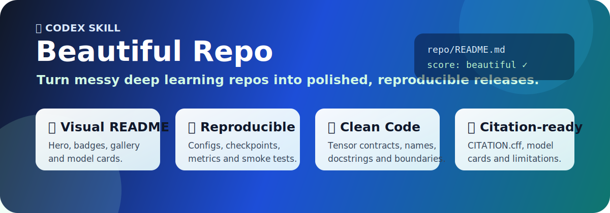

<div align="center">
  
  <h1>✨ Beautiful Repo</h1>
  <p><strong>Turn deep learning repositories into visual, reproducible, citation-ready GitHub releases.</strong></p>
  <p>
    <a href="skills/beautiful-repo/SKILL.md"></a>
    <a href="skills/beautiful-repo/references/readme-standard.md"></a>
    <a href="skills/beautiful-repo/scripts/audit_dl_repo.py"></a>
    <a href="LICENSE"></a>
  </p>
  <p>
    <a href="skills/beautiful-repo/SKILL.md">Skill</a> |
    <a href="skills/beautiful-repo/references/readme-standard.md">README Standard</a> |
    <a href="skills/beautiful-repo/references/code-style-standard.md">Code Style</a> |
    <a href="skills/beautiful-repo/assets/readme-templates/visual-research-readme.md">Visual Template</a> |
    <a href="skills/beautiful-repo/scripts/audit_dl_repo.py">Audit Script</a>
  </p>
</div>

## 🌟 What This Is

**Beautiful Repo** is a Codex skill for upgrading deep learning repositories into releases that people can understand, run, inspect, and cite.

<table>
  <tr>
    <td><strong>🎨 README polish</strong><br>Hero, badges, link hub, screenshots, galleries, quickstart, checkpoints, and result cards.</td>
    <td><strong>🧪 Research release</strong><br>Configs, reproduction docs, model/data cards, citation, license, and limitations.</td>
    <td><strong>🧠 Python quality</strong><br>Docstrings, tensor contracts, names, module boundaries, tests, and CI gates.</td>
  </tr>
</table>

## 🧭 What It Helps Codex Fix

| Area | What gets normalized |
| --- | --- |
| 🗂️ Repository shape | Research-grade layout, configs, scripts, docs, tests, and release metadata. |
| 🚀 Entry points | Stable `train.py`, `eval.py`, `infer.py`, and smoke-test commands. |
| 🎨 README | Visual hero, badges, navigation, screenshots, model cards, checkpoint tables, and results. |
| 🧠 Code style | Clear names, docstrings, tensor shapes, type hints, function boundaries, and side effects. |
| 📦 Research artifacts | Model cards, data cards, `CITATION.cff`, BibTeX, limitations, and acknowledgements. |
| ✅ Quality gates | Import checks, config checks, one-batch tests, CI, and artifact ignore rules. |

## 🚀 Install

Install the skill with any Codex-compatible skills installer that supports GitHub repositories:

```bash
npx skills add <owner>/<repo> --skill beautiful-repo
```

If your installer uses a different command, point it at `skills/beautiful-repo`.

For a local checkout, copy the skill folder into your Codex skills directory:

```text
skills/beautiful-repo -> ~/.codex/skills/beautiful-repo
```

Restart Codex after installation.

## ⚡ Use

Ask Codex:

```text
Use $beautiful-repo to audit this deep learning repository and propose a migration plan.
```

For an implementation pass:

```text
Use $beautiful-repo to normalize this PyTorch repository. Keep old training commands compatible, add missing docs/tests/configs, polish the visual README, and validate with smoke checks.
```

## 🖼️ README Style It Enforces

The bundled README standard pushes deep learning projects toward a richer, easier-to-scan style:

<table>
  <tr>
    <td><strong>✨ First-screen signal</strong><br>Title, tagline, badges, link hub, and one real visual.</td>
    <td><strong>📸 Visual proof</strong><br>Teaser image, architecture diagram, qualitative grid, screenshot, or GIF.</td>
    <td><strong>🧾 Compact facts</strong><br>Task, model, datasets, metrics, checkpoints, runtime, and hardware cards.</td>
  </tr>
  <tr>
    <td><strong>🚀 Fast path</strong><br>Install plus one command before long documentation.</td>
    <td><strong>🏆 Credibility</strong><br>Checkpoint/model tables, result tables, and exact eval commands.</td>
    <td><strong>📚 Research hygiene</strong><br>Reproduction, data, model card, citation, license, and limitations.</td>
  </tr>
</table>

## 📦 Repository Layout

```text
.
  assets/
    beautiful-repo.svg
  skills/
    beautiful-repo/
      SKILL.md
      agents/
        openai.yaml
      references/
        code-style-standard.md
        framework-notes.md
        high-impact-patterns.md
        migration-playbook.md
        readme-standard.md
        repo-type-playbooks.md
        research-release-standard.md
        sources-reviewed.md
      scripts/
        audit_dl_repo.py
      assets/
        readme-templates/
          visual-research-readme.md
  tests/
    test_audit_dl_repo.py
  .github/
    workflows/
      validate.yml
```

## 🧪 What The Skill Optimizes For

The skill is intentionally conservative. It tells Codex to preserve existing behavior, avoid full training runs unless requested, and migrate a repository in small reviewable steps.

It is most useful for research repositories where the expected output is not just clean code, but a reproducible artifact that another researcher can install, run, evaluate, and cite.

The standards were distilled from a representative sample of high-impact deep learning repositories and official project hygiene references, including Transformers, Diffusers, MMDetection, Detectron2, Segment Anything, timm, Ultralytics, nnU-Net, MONAI, PyTorch Lightning, TorchVision, CLIP, PEP 8, PEP 257, GitHub README/CITATION guidance, Ruff, pytest, and Python packaging guidance.

The full source list is in `skills/beautiful-repo/references/sources-reviewed.md`.

## 🔍 Audit Script

The bundled audit script can be run directly:

```bash
python skills/beautiful-repo/scripts/audit_dl_repo.py /path/to/deep-learning-repo
```

The script checks for common release-readiness signals such as README, license, citation metadata, configs, entry points, tests, docs, CI, and artifact ignore rules.

The output is a starting checklist, not a substitute for reading the repository.

## 📛 Name

Recommended public name: **Beautiful Repo**.

Recommended repository slug: `beautiful-repo`.

The skill id is `beautiful-repo`, so prompts stay short:

```text
Use $beautiful-repo to polish this deep learning repo.
```

## 📄 License

MIT
